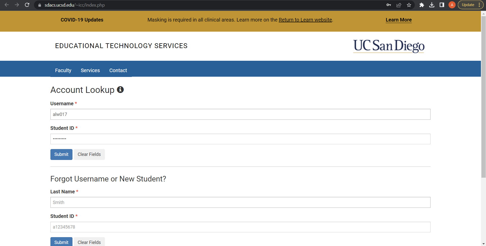
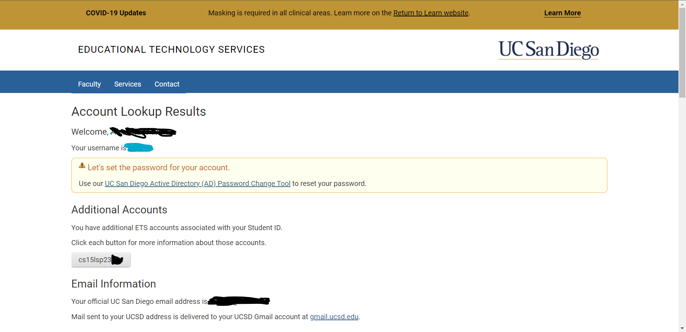
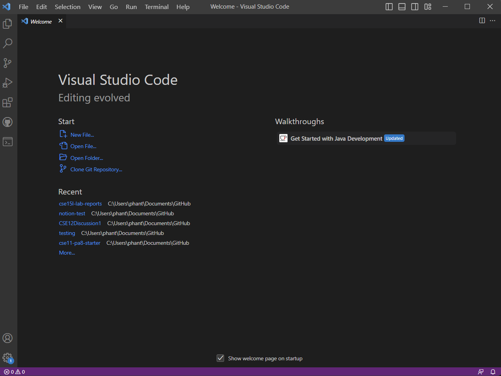
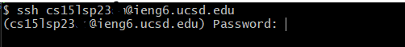
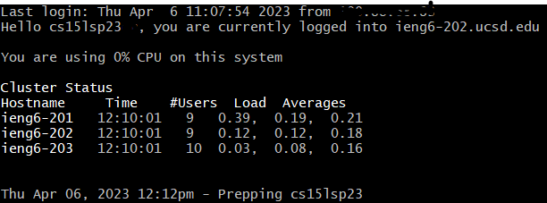
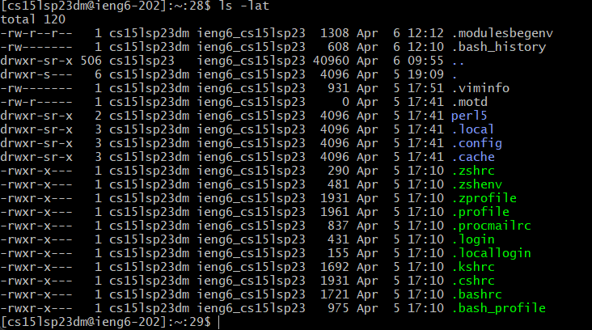

# Lab Report 1 - A How to Guide for Remote Access and File System

## Step 1 - Setting Up

### Your CSE 15L Lab Account
Find your associated CSE15l account and change the password for the account. You can do this on the website:  
[https://sdacs.ucsd.edu/~icc/index.php](https://sdacs.ucsd.edu/~icc/index.php)

You should see this once you get on the website. In the top two boxes, labeled "Username" and "Student ID," fill in your school account username (the one you sign into duo with) and student id, with the A, but in lowercase.   

For example: 

Username: jsmith  
Student ID: a12345678

After looking up your account, you should see something like this:

  

Under the **Additional Accounts** header, look for an an account name that starts with "cse15l", followed by the quarter and year that you are taking the class, and two random letters.

The for me, my username looked similar to this: 
cse15lsp23zz 

The "zz" at the end of the username is your specific account, and is different for every person. The letters "sp" stand for spring, and change depending on which quarter you're taking the class. Replace those letters with ones relevant to you, and write it down somewhere.

Next, click on the "UC San Diego Active Directory (AD) Password Change Tool" hyperlink to change your password.

Click on "Proceed to the Password Change Tool"

Enter the username you wrote down earlier.

Follow the instructions listed, and then you will have setup your lab account. It might take up to 30-40 minutes for the password change to update in the system.

### VSCode

I already had VSCode installed on my laptop, so I didn't need to install it. 

If you need to install VSCode, head to [https://code.visualstudio.com/download](https://code.visualstudio.com/download) and follow the instructions for Windows, Mac, or Linux depending on your computer.  

You should see something like this when you finish installing VSCode, and open it for the first time.

### git bash

Go to [https://gitforwindows.org/](https://gitforwindows.org/) and install git. Run the installer, and follow all instructions.

Now you're ready to connect to the server!

## Step 2 - Remotely Connecting

For Windows Users:

Open git bash, and type in
`ssh <your lab username>@ieng6.ucsd.edu`

The first time you connect, you might be prompted with a message like this:  
`The authenticity of host 'ieng6.ucsd.edu (128.54.70.227)' can't be established.
RSA key fingerprint is SHA256:ksruYwhnYH+sySHnHAtLUHngrPEyZTDl/1x99wUQcec.
Are you sure you want to continue connecting (yes/no/[fingerprint])? `  

Type in "yes". This is expected for the first time connecting to a new server.

Then you will be prompted with something like this:

Enter the password that you set earlier. It will not indicate that you are typing, but you are still typing.

When you login successfully, you will see a lot of output, followed by your username in some brackets at the bottom.  
This means you successfully logged in. This is what I saw as I logged in. You might see more output.

## Step 3 - Trying Some Commands

Now that you have logged in, you can try some commands!

Here's a list of commands that I used:

 - `cd` - change directory to home.
 - `cd ~` - change directory to home.
 - `ls -lat` - list with optional arguments l, a, and t in the working directory.
 - `ls -lsra` - list with optional arguments l, s, r, a in the working directory.
 - `cp /home/linux/ieng6/cs15lsp23/public/hello.txt ~/` - copy a file from the first path to the second path.
 - `cat /home/linux/ieng6/cs15lsp23/public/hello.txt` - print out the contents of the file at the given path.

 Here was the result that I got for `ls -lat` executed in my home directory.

 

