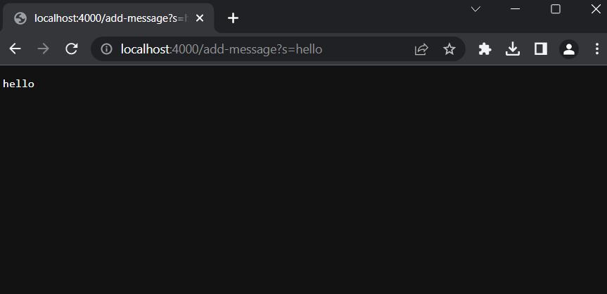
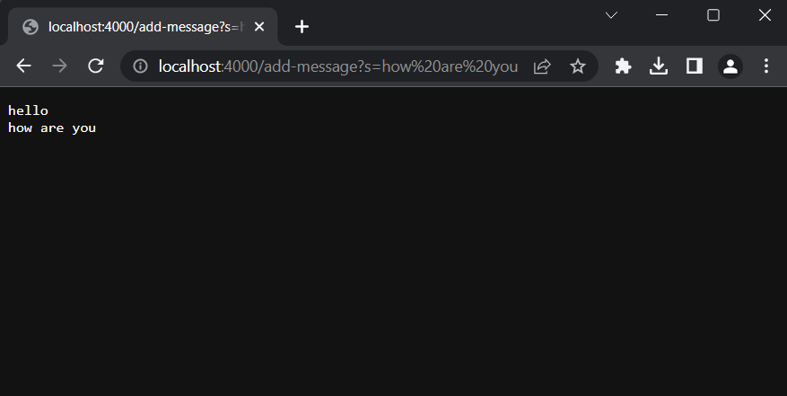
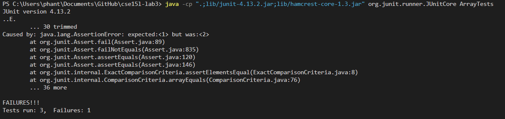

# Lab Report 2 - Servers and Bugs

## Part 1 - Web Server

Here was the code I wrote for my web server in java.

```java
import java.io.IOException;
import java.net.URI;
import java.util.ArrayList;
import java.util.List;

class Handler implements URLHandler {
    public List<String> messages = new ArrayList<>();

    public String handleRequest(URI url) {
        String path = url.getPath();
        String[] params;
        if(path.equals("/add-message")) {
            params = url.getQuery().split("=");
            if(params[0].equals("s")) {
                this.messages.add(params[1]);
            }
            return allMessages();
        }
        return "404 Not Found";
    }

    public String allMessages() {
        String output = "";
        for(String s : messages) {
            output += s + "\n";
        }
        return output;
    }
}

public class StringServer {

    public static void main(String[] args) throws IOException {
        if (args.length == 0) {
            System.out.println("Missing port.");
            return;
        }
        int port = Integer.parseInt(args[0]);

        Server.start(port, new Handler());
    }
}
```

### Using `/add-message` multiple times:

### Example 1



When I entered the url in the screenshot, the `handleRequest(URI url)` method is called on the server, processing the url I entered. 

Relevant Method Calls:
```java
handleRequest(URI url)
getPath()
getQuery()
split(String regex)
equals(Object anObject)
messages.add()
allMessages()
```

There is also a relevant field, `messages` which references an arraylist, and a local variable `path` which is the return value of `url.getPath()`.

`handleRequest(URI url)` has one relevant parameter, url, which is the url of that the user making the request to the server has entered. 

`split(String regex)` has one relevant parameter, regex, which splits the string into array elements by using the string passed into the method as a separator.

`equals(Object anObject)` since we are calling equals from a String object, there is a special implementation which checks if all chars in the string are equivalent. 

From this request, the arraylist referenced by the variable messages changes, getting a new String added to it. Although the messages field itself is not changing, still referencing the same object, the data in the object it references is changing. In this first case, the ArrayList starts empty, so now it changes to have one element, with the string `"hello"`.

Also, within the method, local variable `path` is being set to `"/add-message"` and `params` is set equal to a list with elements `{"s", "hello"}`.

### Example 2



In the second example, the path is the same, so the relevant method calls are the same as in the first example.

Relevant Method Calls:
```java
handleRequest(URI url)
getPath()
getQuery()
split(String regex)
equals(Object anObject)
messages.add()
allMessages()
```

The relevant fields and local variables also stay the same. 

`handleRequest(URI url)` has one relevant parameter, url, which is the url of that the user making the request to the server has entered. 

`split(String regex)` has one relevant parameter, regex, which splits the string into array elements by using the string passed into the method as a separator.

`equals(Object anObject)` since we are calling equals from a String object, there is a special implementation which checks if all chars in the string are equivalent. 

In the second example, there is already one String, `"hello"` in the ArrayList, so after the handler finishes executing the method `handleRequest()`, the ArrayList now has a second element `"how are you"`.

For local variables, `path` is set to `"/add-message"` again, and `params` is set equal to a list with elements `{"s", "how are you"}`.

## Part 2 - Bugs

For this part, I chose to write about the method `reverseInPlace()` from Lab 3.

### Failure Inducing Input:
```java
public void testReverseInPlace() {
    int[] input = {0, 1, 2, 3};
    ArrayExamples.reverseInPlace(input);
    assertArrayEquals(new int[]{3, 2, 1, 0}, input);
}
```
Inputting list `{0, 1, 2, 3}` should return `{3, 2, 1, 0}`, but we get the error:

`Caused by: java.lang.AssertionError: expected:<1> but was:<2>`

In reality, the list returned was `{3, 2, 2, 3}`.

### Input with Proper Functionality:
```java
public void testReverseInPlace() {
    int[] input = { 3 };
    ArrayExamples.reverseInPlace(input);
    assertArrayEquals(new int[]{ 3 }, input);
}
```

Inputting list `{3}` should return `{3}` and does.

### Symptom:

JUnit Output:


Note that there were some other tests in the code, but the relevant one that failed was the same as on one I explained above.

### The Bug:
Before:
```java
static void reverseInPlace(int[] arr) {
    for(int i = 0; i < arr.length; i += 1) {
        arr[i] = arr[arr.length - i - 1];
        
    }
}
```
After:
```java
static void reverseInPlace(int[] arr) {
    int[] temp = arr.clone(); 
    for(int i = 0; i < arr.length; i += 1) {
        arr[i] = temp[arr.length - i - 1];
        
    }
}
```

This fixes the issue, because originally, data from the end of the list was being lost as the list was being reversed. As the method looped through the list, the original values of the first half of the list were lost. So, when the list reached the second half of the list, it would copy over the newly set values, which isn't correct. Creating a deep copy of the original list is a small change that fixes the issue of the original algorithm. 


## Part 3 

Something I learned from week 2 and 3 of lab was how localhost addresses worked. I used to think that localhost was an address on a local network, like your home router network. Now I understand that localhost is a way to say that it is the address of the computer that is currently running the program.  