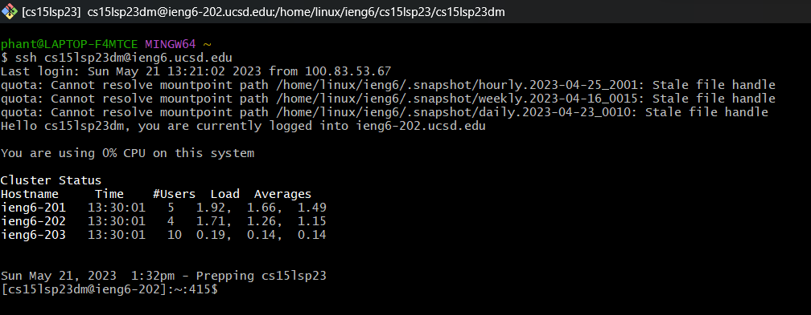
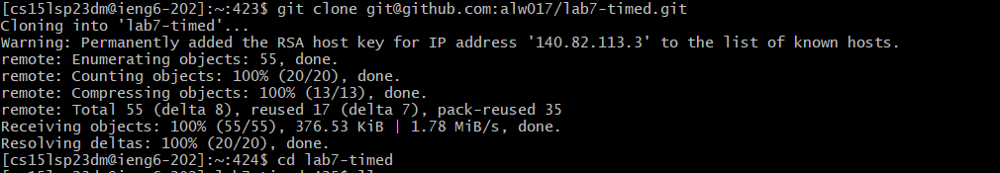
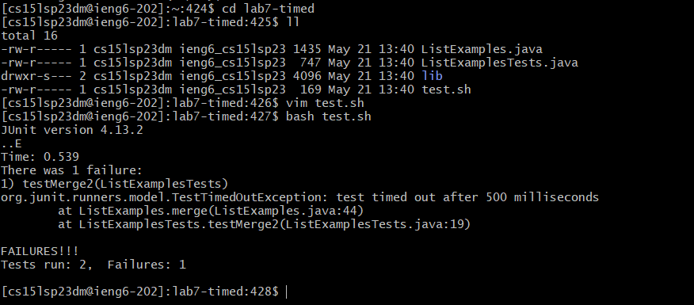
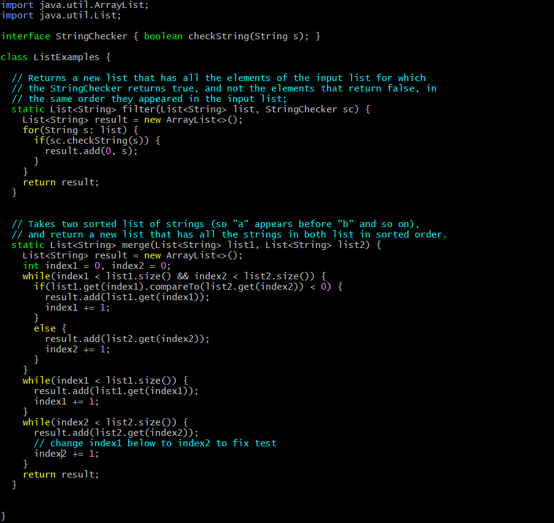
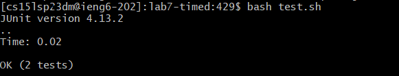
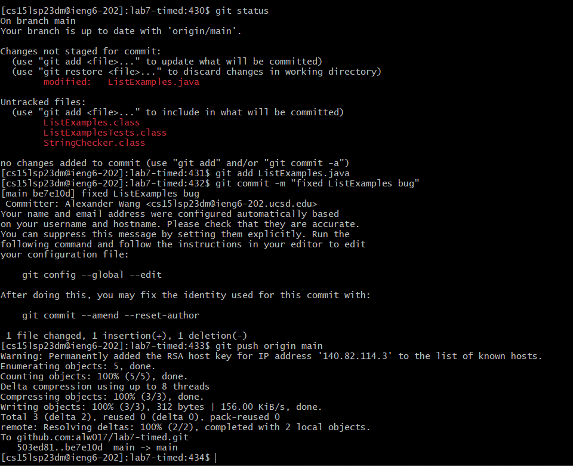

# Lab 4 - Doing it all in the terminal

## Steps:

### Step 4:


Keys Pressed:  
```ssh <space> cs15lsp23dm@ieng6.ucsd.edu <enter>```

```ssh``` logs me into my school-assigned terminal where I can remotely access the computer that I am connected to on the UCSD's servers. I didn't have to enter any password because I had already authenticated my personal PC's ssh key on the school's computer.


### Step 5:


Keys Pressed:  
```git clone <shift><insert> <enter>```

I had copied the link to the repository from github, and pasted it in the terminal to reduce the time I have to type.

The command `git clone` creates a copy of the repository and puts it in a folder with the name of the repository in the current working directory to edit.

### Step 6:


Keys Pressed:  
`cd <space> lab7-timed <enter> ll <enter> vim <space> test.sh <enter> :q! <enter> bash <space> test.sh <enter>`

I changed directory into the repository I just cloned, and then ran `ll` which is like ls but automatically puts the files as if you ran ls with the `-l` option. 

Then, to check the contents of `test.sh`, I use vim to read the file and see what it does. Afterwards, I quit without making changes using `:q!` and run `bash test.sh` which compiles the files and runs the tests on `ListExamples`.

### Step 7:


Keys Pressed:  
`vim <space> List<tab>.java <enter> <shift>G ?index<enter> cw index2 <esc> :wq <enter>`

I run vim on the `ListExamples.java` file to edit it. Once inside vim, I used `<shift>G` to go to the end of the file, then `?index<enter>` to look backwards for the first occurence of index. From there, I use `cw` to delete `index1` and immediately enter insert mode to enter `index2` which is the current replacement. Afterwards, I exit insert mode with `<esc>` and save and quit with `:wq<enter>`. This fixes the bug causing the test failure.

### Step 8:


Keys Pressed:
`<up> <up> <enter>`

This runs the `bash test.sh` command again, which compiles both java files and runs the tests `ListExamples` with the newly compiled classes.

### Step 9:


Keys Pressed:
`git <space> status <enter> git <space> add <space> List<tab>.java <enter> git <space> commit <space> -m <space> "fixed ListExamples bug" <enter> git <space> push <space> origin <space> main <enter>`

These git status lists all of the changes I have made to the directory, listing any new files I've created and any modifications I have made to existing files in the directory. 

From there, I use that information to add the `ListExamples.java` file, staging it before commiting. Afterwards, I use `git commit -m "fixed ListExamples bug"` to commit the added changes, with the `-m` option specifying a message of fixing the bug in ListExamples.java. 

Finally, I use `git push origin main` to push the committed changes I made to the main branch, which now should appear as a new change made on GitHub.
